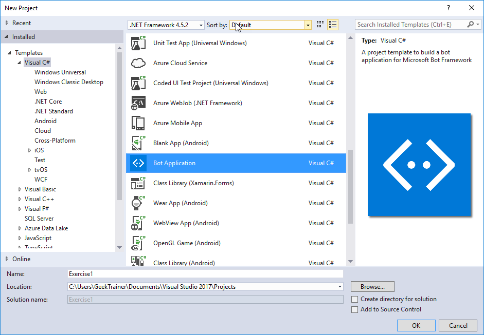
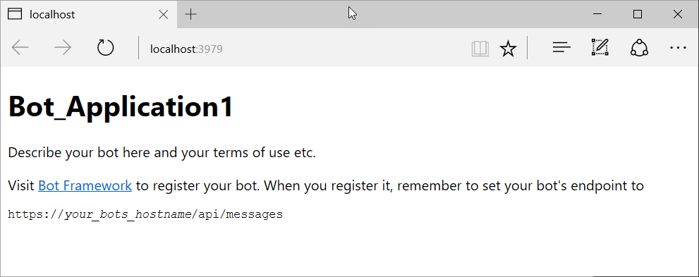
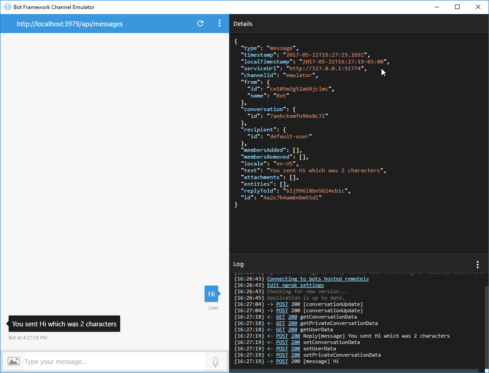

# 演習 1: Bot Builder SDK for .NET による初めての "おうむ返し" ボットの作成

## 概要

この演習では、[Bot Builder SDK for
.NET](https://github.com/Microsoft/BotBuilder) を使用してボットを構築し、それを
Bot Framework Emulator でテストする方法を示します。

Bot Builder SDK for .NET は、Visual Studio と Windows
を使用してボットを開発するための、使いやすいフレームワークです。SDK では C\#
を活用し、.NET
開発者にとってなじみのある方法で強力なボットを作成する手段を提供します。

[このフォルダー](./exercise1-EchoBot)の中には、Visual
Studio
ソリューションと、この演習のステップで作成するコードが入っています。このソリューションは、演習を進めるにあたってさらにヒントが必要な場合に、ガイダンスとして使用できます。

**注:** Bot Builder SDK for .NET は現在 C\# をサポートしています。Visual Studio
for Mac はサポートされていません。

## 前提条件

この演習を完了するには、以下が必要です。

-   [Visual Studio 2017 Community](https://www.visualstudio.com/downloads) 以上

-   [Bot Framework Emulator](https://emulator.botframework.com/)
    (ボットのテストに使用するクライアント)

## タスク 1: ボット アプリケーション テンプレートを使用して新規ボットを作成する

1.  [ボット アプリケーション
    テンプレート](http://aka.ms/bf-bc-vstemplate)をダウンロードし、.zip
    ファイルを Visual Studio 2017 プロジェクト テンプレート
    ディレクトリに保存してテンプレートをインストールします。Visual Studio 2017
    プロジェクト テンプレート
    ディレクトリは通常、以下の場所にあります。%USERPROFILE%\\Documents\\Visual
    Studio 2017\\Templates\\ProjectTemplates\\Visual C\#\\

1.  Visual Studio を開き、新規 C\#
    プロジェクトを作成します。新規プロジェクトのボット アプリケーション
    テンプレートを選択します。次の演習で名前空間の問題が発生するのを回避するために、プロジェクト名には HelpDeskBot を使用します。
    
    
    
    ボット アプリケーション テンプレートを使用することで、単純なボットの作成に必要なすべてのコンポーネントが既に含まれているプロジェクトを作成することになります。これには、Microsoft.Bot.Builder NuGet パッケージに含まれる **Bot Builder SDK for .NET** への参照も含まれます。ただし、最初に、SDK の最新バージョンを使用していることを確認してください。

1.  **ソリューション エクスプローラー**でプロジェクトの [参照]
    フォルダーを右クリックして、[NuGet パッケージの管理] をクリックします。

1.  [更新] タブで、「Microsoft.Bot.Builder」と入力します。

1.  検索結果のリストでパッケージを見つけ、パッケージの [更新]
    ボタンをクリックします。

1.  表示に従って、変更を受け入れ、パッケージを更新します。

    ボット アプリケーション テンプレートを使用することで、プロジェクトには、このチュートリアルでボットを作成するために必要なコードがすべて含まれます。際、追加のコードを記述する必要はありません。しかし、ボットのテストに移る前に、ボット アプリケーション テンプレートのコードの一部を少し見てみましょう。

## タスク 2: ボットのコードを調べる

1.  最初に、Controllers\\MessagesController.cs 内の Post
    メソッドがユーザーからメッセージを受信し、ルート ダイアログを呼び出します。
    
    ダイアログは、会話のモデル化と会話のフローの管理に使用されます。各ダイアログは、IDialog を実装する C\# クラスで自らの状態をカプセル化するアブストラクションです。ダイアログは、別のダイアログで構成して再利用を最大化することができ、ダイアログのコンテキストは、任意の時点の会話でアクティブなダイアログのスタックを維持します。また、ダイアログで構成される会話はコンピューター間で移植可能なため、ボットの実装の規模の調整が可能になります。

    ```csharp
    [BotAuthentication]
    public class MessagesController : ApiController
    {
        /// <summary>
        /// POST: api/Messages
        /// Receive a message from a user and reply to it
        /// </summary>
        public async Task<HttpResponseMessage> Post([FromBody]Activity activity)
        {
            if (activity.Type == ActivityTypes.Message)
            {
                await Conversation.SendAsync(activity, () => new Dialogs.RootDialog());
            }
            else
            {
                HandleSystemMessage(activity);
            }
            var response = Request.CreateResponse(HttpStatusCode.OK);
            return response;
        }
        ...
    }
    ```

1.  ルート
    ダイアログはメッセージを処理し、応答を生成します。Dialogs\\RootDialog.cs
    内の MessageReceivedAsync メソッドは、ユーザーのメッセージの先頭に “You
    sent”、末尾に “which was \#\# characters” (\#\#
    はユーザーのメッセージの文字数)
    のテキストを付けて、おうむ返しに返信を送ります。
    
    ダイアログは、ボットのロジックを整理し、会話のフローを管理するのに役立ちます。ダイアログはスタック化して配置され、スタックの最上位のダイアログは、ダイアログが閉じるか別のダイアログが呼び出されるまで、すべての受信メッセージを処理します。

    ```csharp
    [Serializable]
    public class RootDialog : IDialog<object>
    {
        public Task StartAsync(IDialogContext context)
        {
            context.Wait(MessageReceivedAsync);
            return Task.CompletedTask;
        }

        private async Task MessageReceivedAsync(IDialogContext context, IAwaitable<object> result)
        {
            var activity = await result as Activity;

            // calculate something for us to return
            int length = (activity.Text ?? string.Empty).Length;

            // return our reply to the user
            await context.PostAsync($"You sent {activity.Text} which was {length} characters");

            context.Wait(MessageReceivedAsync);
        }
    }
    ```

## タスク 3: ボットをテストする

次に、Bot Framework Emulator
を使用してボットをテストし、動作の様子を見てみましょう。このエミュレーターは、localhost
上のボット、またはトンネルを通じてリモートで実行しているボットをテストおよびデバッグできる、デスクトップ
アプリケーションです。エミュレーターは、Web チャットの UI
に表示されるとおりにメッセージを表示し、JSON
要求をログに記録し、ユーザーがボットとメッセージをやり取りするとおりに応答します。

1.  まず、エミュレーターをダウンロードしてインストールする必要があります。[こちら](https://emulator.botframework.com/)を参照してダウンロードしてください。ダウンロードの完了後、実行可能ファイルを起動して、インストール
    プロセスを完了します。

2.  エミュレーターのインストール後、IIS Express をアプリケーション
    ホストとして使用して、Visual Studio でボットを起動します。
    
    

1.  [実行] ボタンをクリックすると、以下のように、Visual Studio
    がアプリケーションを構築して localhost に展開し、Web
    ブラウザーを起動してアプリケーションの default.htm ページを表示します。
    
    

>   **注:** Windows ファイアウォールの警告が表示される場合は、[アクセスを許可] をクリックします。

1.  次に、エミュレーターを起動し、ボットに接続します。アドレス バーに
    http://localhost:3979/api/messages
    と入力します。これは、ボットがローカルにホストされたときにリッスンする既定のエンドポイントです。

2.  [ロケール] を en-US に設定し、[接続]
    をクリックします。ボットをローカルに実行しているので、[Microsoft App ID] と
    [Microsoft App Password]
    を指定する必要はありません。これらのフィールドは、今のところ空白のままにしてかまいません。この情報は、演習
    5 で Bot Framework Portal にボットを登録する際に取得します。

3.  送信した各メッセージに対して、メッセージの先頭に "You sent"、末尾に "which
    was \#\# characters" (\#\# はユーザーのメッセージの文字数)
    のテキストを付けて、おうむ返しにボットが応答するのを確認できます。
    
    
