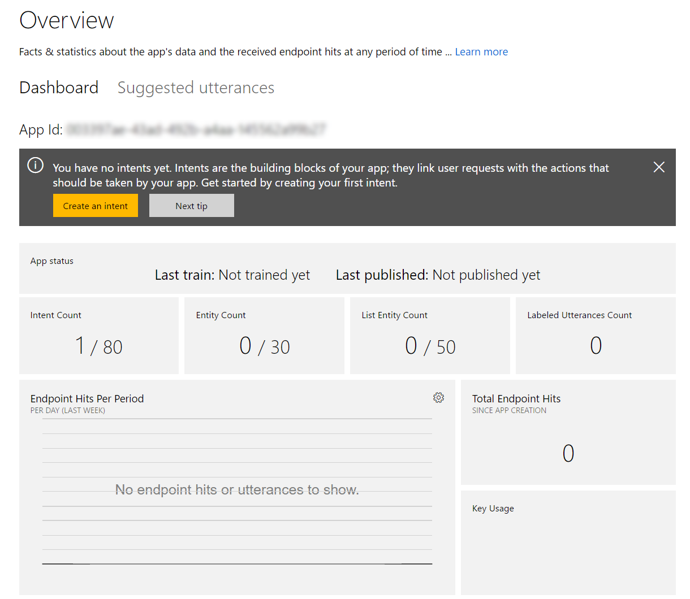
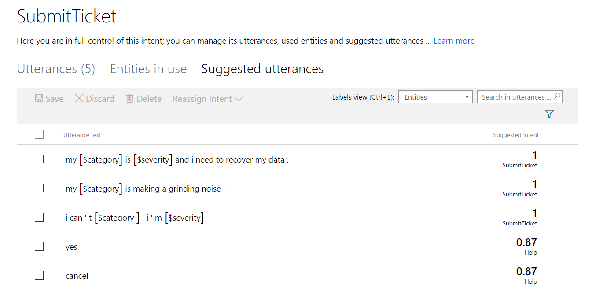

# 演習 3: 言語理解の機能によるボットのスマート化 (C\#)

## 概要

人間とコンピューターとの対話式操作における大きな問題の 1
つに人間が何を欲しているかをコンピューターが理解する能力があります。LUIS
は、人間の言語を理解することにより、ユーザーの要求に応じることができるスマート
アプリケーションを開発者が構築できるように設計されています。

この演習では、ヘルプ デスク
ボットに自然言語理解機能を追加して、ユーザーがチケットを容易に作成できるようにする方法を学習します。そのためには、Azure
Cognitive Services オファリングの一部である LUIS (Language Understanding
Intelligent Service)
を使用します。これはボットがコマンドを理解して行動できるようにさせるための言語モデルを、開発者が構築できるようにします。たとえば、前の演習ではユーザーが重大度とカテゴリを入力する必要がありました。今回は、ユーザーのメッセージから両方の
"エンティティ" が認識されるようにします。

[こちらのフォルダー](./exercise3-LuisDialog)の中には、Visual
Studio
ソリューションと、この演習のステップの完了結果として得られるコードが入っています。このソリューションは、演習を進めるにあたってさらにヒントが必要な場合に、ガイダンスとして使用できます。

## 前提条件

この演習を完了するには、以下のソフトウェアが必要です。

-   [Visual Studio 2017 Community](https://www.visualstudio.com/downloads) 以上

-   [Azure](https://azureinfo.microsoft.com/us-freetrial.html?cr_cc=200744395&wt.mc_id=usdx_evan_events_reg_dev_0_iottour_0_0)
    サブスクリプション

-   [Bot Framework Emulator](https://emulator.botframework.com/) (en-US
    ロケールで構成されていることを確認します)

-   [LUIS ポータル](https://www.luis.ai/)のアカウント

## タスク 1: LUIS アプリを作成する

このタスクでは、LUIS ポータルでアプリを作成します。

**注:** 既に LUIS に習熟している場合は、この演習の
[assets](../assets/exercise3-LuisDialog)
フォルダーにあるファイル luis\_model.json
を各自のアカウントにインポートして、モデルをトレーニングおよび発行し、タスク 4
に進むことができます。しかし、LUIS
の初心者である場合は、学習のためにモデルを最初から作成することをお勧めします。

1.  [LUIS ポータル](https://www.luis.ai/)に移動してサインインします。[My apps]
    タブを開きます。

2.  [New App] をクリックします。ダイアログ ボックスにアプリケーションの名前
    (たとえば、「HelpDeskBot」)
    を入力します。まだ選択されていない場合は、[Culture] で [English]
    を選択します。

   

3.  [Key to use] を選択します。まだ何も選択していない場合は、既定として
    BoostrapKey が作成されます。

4.  [Create] をクリックします。空の LUIS アプリ ダッシュボードが表示されます。

   

5.  後で使用できるように **App ID** を保存します。

6.  ページ上部の [My keys]
    メニューに移動します。移動すると、後での使用に備えて保存した Programmatic
    API キーが表示されます。

   

## タスク 2: LUIS に新しいエンティティを追加する

このタスクでは、LUIS
アプリにエンティティを追加します。これによって、ボットはチケットのカテゴリと重大度を、ユーザーが入力した問題の説明から理解できるようになります。エンティティはアプリケーションのドメインの「名前」です。エンティティは、類似のオブジェクト
(場所、もの、人間、イベントまたは概念) の集合を含むクラスを表します。

このラボでは、List エンティティ タイプを使用します。これにより、一般に
"クローズド リスト"
と呼ばれるものを作成できます。これは、用語に**機械学習を適用せず**、直接一致を使用することを意味します。用語の正規化の試行時、または一定のキーワードが常にエンティティとしてピックアップされることを保証する場合に非常に有益です。

1.  LUIS ポータルの左パネルで [Entities] をクリックします。

2.  [Add custom entity] をクリックします。

3.  表示されたダイアログで [Entity name] に「category」と入力します。[Entity
    type] には "List" を選択します。[Save] をクリックします。

   

4.  新しいページが表示され、そのページで使用可能な値を追加できます。この処理をスピードアップするには、[Imports
    Lists] リンクをクリックします。

5.  このハンズオン ラボのルートにある
    [assets](../assets)
    フォルダーで categories.json ファイルを探します。有効化したら、[Import]
    をクリックします。

6.  "severity"
    という名前の新しいエンティティでもこの処理を繰り返します、同じ場所にある
    "severities.json" という名前のファイルを使用して読み込みます。

   

7.  次に、左パネルの [Train & Test] をクリックします。

8.  [Train Application]
    をクリックして、完了するまで数秒間待ちます。現在のモデルを更新する際はいつでも、アプリをトレーニングしてからテスト/発行する必要があります。

## タスク 3: インテントおよび発話を追加する

インテントは発話 (文)
を通じて伝達される意図または望まれるアクションです。インテントは、ボットにアクションを実行させることでユーザーの要求に応じます。このため、ボットがユーザーの要求を理解し、適切に対応できるようにインテントを追加する必要があります。

発話は、ボットに受信/解釈させるためのユーザー
クエリやコマンドのサンプルを表す文です。アプリ内の各インテントにサンプルの発話を追加する必要があります。LUIS
がこれらの発話から学習すると、アプリは同様のコンテキストの一般化および理解が可能になります。発話を継続的に追加して、ラベル付けすることで、ボットの言語学習エクスペリエンスが向上します。

インテントの詳細については、[こちら](https://docs.microsoft.com/en-us/azure/cognitive-services/LUIS/add-intents)を、発話については[こちら](https://docs.microsoft.com/en-us/azure/cognitive-services/LUIS/add-example-utterances)を参照してください。

1.  LUIS ポータルの左パネルで [Intents] をクリックします。既に "None"
    インテントが存在することがわかります。

2.  [Add Intent] をクリックすると、ポップアップが表示されます。[Intent name]
    に「SubmitTicket」と入力して、[Save] をクリックします。

3.  次は、テキスト ボックスに次の発話を追加します。1 つ入力するごとに Enter
    キーを押します。ユーザーがこれらの文または類似の文を入力すると、LUIS
    アプリはユーザーがチケットを送信しようとしていると想定します。Bot Framework
    言語ではこれを "インテント" と呼びます。

    -   I can't log in, I'm blocked.
        (ログインできません。ブロックされています。)

    -   I cannot print and I need to do it urgently.
        (印刷できません、すぐに印刷する必要があります。)

    -   I need to request a new RAS token. (新しい RAS
        トークンを要求する必要があります。)

    -   I need to reset my password ASAP.
        (即座にパスワードをリセットする必要があります。)

    -   I cannot open a web page and my deadline is at risk. (Web
        ページが開けません、期限が迫っています。)

>   **注:** 発話は必要なだけ追加できます。追加する発話が多いほど、アプリがユーザーのインテントを認識する能力が高まります。ここで使用する例の場合、非常に多様な発話 (ハードウェアの問題もあれば、ソフトウェアの問題もあります) が SubmitTicket を起動する可能性があるため、ボットを実稼働に向けてリリースする前に大量の発話でボットをトレーニングすることが理想です。

4.  [Save] () をクリックします。

5.  前述の手順を使用して、発話を "help"、"hi"、"hello" として新しい Help
    インテントを追加します。

   

> **注:** 他のインテントと異なる場合でも、"None" インテントに発話をいくつか追加することをお勧めします。トレーニング サンプルを指定しても、"None" インテントを起動するテキストに制約はかかりませんが、他のインテントの起動精度の向上に役立ちます。

6.  前述の説明に従って、アプリを再度トレーニングします。

7.  [Intents] メニューを開き、[SubmitTicket]
    インテントをクリックします。発話がエンティティ値によって認識されることを確認します。

   

8.  次に、LUIS
    アプリを発行してボットから使用できるようにします。左側のメニューの [Publish
    App] をクリックします。

9.  [Endpoint key] が選択されていることを確認します。既定の [Production]
    スロットはそのままにします。

10.  [Publish] をクリックします。新しい確認メッセージの表示後に LUIS
    アプリが発行されます。
    
    LUIS アプリの出力が、HTTP エンドポイント (自然言語の理解を追加する際にボットから参照する) が設定された Web サービスであることがわかります。

> **注:** BoostrapKey は 1 か月あたり 1000 のトランザクションが存在します。

## タスク 4: LUIS を使用するようにボットを更新する

このタスクでは、ボット コードを更新して、前の手順で作成した LUIS
アプリを使用するようにします。

1.  前の演習から得られたソリューションを開きます。または、[exercise2-TicketSubmissionDialog](./exercise2-TicketSubmissionDialog)
    フォルダーから Exercise2.sln ソリューションを開くこともできます。

2.  **Dialogs\\RootDialog.cs** ファイルを開きます。

3.  ステートメントを使用して Microsoft.Bot.Builder.Luis と
    Microsoft.Bot.Builder.Luis.Models を追加します。

    ```csharp
    using Microsoft.Bot.Builder.Luis;
    using Microsoft.Bot.Builder.Luis.Models;
    ```

4.  次のようにして、LuisModel 属性をクラスに追加します。{LUISAppID} を LUIS
    ポータルから保存したアプリ ID に置き換え、{LUISKey} を My Keys
    セクションから保存したプログラマティック API キーに置き換えます。

    ```csharp
    [LuisModel("{LUISAppID}", "{LUISKey}")]
    ```
5.  インターフェイス IDialog の実装を、LuisDialog\<object\>
    から導出するように置き換えます。メソッド
    StartAsync、MessageReceivedAsync、および DescriptionMessageReceivedAsync
    は、呼び出されなくなるため、削除します。

    ```csharp
    public class RootDialog : LuisDialog<object>
    ```

6.  LUIS モデルがインテントを検出したときに実行される None
    メソッドを作成します。属性 LuisIntent
    を使用し、インテント名をパラメーターとして渡します。

    ```csharp
    [LuisIntent("")]
    [LuisIntent("None")]
    public async Task None(IDialogContext context, LuisResult result)
    {
        await context.PostAsync($"I'm sorry, I did not understand {result.Query}.\nType 'help' to know more about me :)");
        context.Done<object>(null);
    }
    ```

7.  次のコードを追加して、ユーザーにメッセージで応答するHelp
    インテントを処理します。

    ``` csharp
    [LuisIntent("Help")]
    public async Task Help(IDialogContext context, LuisResult result)
    {
        await context.PostAsync("I'm the help desk bot and I can help you create a ticket.\n" +
                                "You can tell me things like _I need to reset my password_ or _I cannot print_.");
        context.Done<object>(null);
    }
    ```

8.  次のコードを追加して、インテント SubmitTicket
    を処理するメソッドを追加します。TryFindEntity
    メソッドを使用して、発話にエンティティが存在するかどうかを判定して、それを抽出します。

    ``` csharp
    [LuisIntent("SubmitTicket")]
    public async Task SubmitTicket(IDialogContext context, LuisResult result)
    {
        EntityRecommendation categoryEntityRecommendation, severityEntityRecommendation;

        result.TryFindEntity("category", out categoryEntityRecommendation);
        result.TryFindEntity("severity", out severityEntityRecommendation);

        this.category = ((Newtonsoft.Json.Linq.JArray)categoryEntityRecommendation?.Resolution["values"])?[0]?.ToString();
        this.severity = ((Newtonsoft.Json.Linq.JArray)severityEntityRecommendation?.Resolution["values"])?[0]?.ToString();
        this.description = result.Query;

        await this.EnsureTicket(context);
    }
    ```

9.  次に、EnsureTicket
    メソッドを作成します。これは、エンティティが識別されたかどうかを検証し、識別されていない場合はユーザーに不足のエンティティの入力を求めるものです。

    ``` csharp
    private async Task EnsureTicket(IDialogContext context)
    {
        if (this.severity == null)
        {
            var severities = new string[] { "high", "normal", "low" };
            PromptDialog.Choice(context, this.SeverityMessageReceivedAsync, severities, "Which is the severity of this problem?");
        }
        else if (this.category == null)
        {
            PromptDialog.Text(context, this.CategoryMessageReceivedAsync, "Which would be the category for this ticket (software, hardware, networking, security or other)?");
        }
        else
        {
            var text = $"Great! I'm going to create a **{this.severity}** severity ticket in the **{this.category}** category. " +
                    $"The description I will use is _\"{this.description}\"_. Can you please confirm that this information is correct?";

            PromptDialog.Confirm(context, this.IssueConfirmedMessageReceivedAsync, text);
        }
    }
    ```

10. 次のように、SeverityMessageReceivedAsync および CategoryMessageReceivedAsync を更新して、EnsureTicket メソッドをコール バックするようにします。
    
    ```csharp
    private async Task SeverityMessageReceivedAsync(IDialogContext context, IAwaitable<string> argument)
    {
        this.severity = await argument;
        await this.EnsureTicket(context);
    }
    ```
    
    ```csharp
    private async Task CategoryMessageReceivedAsync(IDialogContext context, IAwaitable<string> argument)
    {
        this.category = await argument;
        await this.EnsureTicket(context);
    }
    ```

## タスク 5: エミュレーターからボットをテストする

1.  アプリを実行してエミュレーターを開きます。ボットの URL
    (http://localhost:3979/api/messages) をいつもどおり入力します。

2.  「hi」と入力します。Help
    インテントがどのように認識され、実行されるかがわかります。

   

3.  ボットのトレーニングに使用した発話のいずれかを入力します。たとえば「I can't
    log in, I'm
    blocked」と入力します。ユーザーのメッセージから、チケットのカテゴリおよび重大度が自動的に把握されます。「yes」と入力して、チケットを保存します。

   

4.  次に、ボットのトレーニングに使用されていない発話を入力してみます。例: My
    computer is making a grinding noise. (コンピューターが摩擦音を立てています)
    重大度は把握されていませんが、エンティティ computer
    が存在するためカテゴリは把握されています。

   

5.  LUIS が認識できない発話を入力すると、LUIS は “None” インテントを返し、ボット
    フレームワークは既定のダイアログ ハンドラーを実行します。

   
   
   アプリケーションを展開し、システムにトラフィックへの流入が開始すると、LUIS はアクティブ ラーニングを使用して、自己改善します。アクティブ ラーニング プロセスで、LUIS はあまり確信できない発話を特定して、インテントまたはエンティティに従ってその発話にラベル付けすることを求めます。LUIS ポータルのインテント内には [Suggested Utterances] セクションが存在し、そこではラベル付けを実行できます。

   

## その他の課題

自主的に学習を続ける場合は、次のタスクを利用できます。

-   cancelActionを使用して SubmitTicket ダイアログにキャンセル イベント
    ハンドラーを追加する。

-   beginDialogAction を使用して SubmitTicket
    内でユーザーにヘルプを提供するためのカスタム ダイアログを追加する。

-   onEnabled イベントを使用して、cancel が呼び出されない限り、開始された
    SubmitDialog が完了することを保証する。

-   チケットのステータスをボットに要求する機能を追加する。チケットにステータス
    プロパティを追加し、新しいダイアログを起動する LUIS
    アプリの新しいインテントを追加する必要があります。

## 追加参考資料

-   [Manage conversation
    flow](https://docs.microsoft.com/en-us/bot-framework/dotnet/bot-builder-dotnet-manage-conversation-flow)

-   [Managing conversations and dialogs in Microsoft Bot Framework using
    Node.JS](http://blog.geektrainer.com/2017/02/21/Managing-conversations-and-dialogs-in-Microsoft-Bot-Framework-using-Node-JS/)
