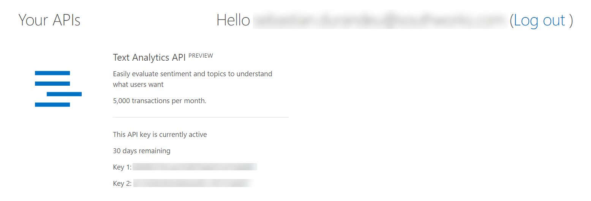
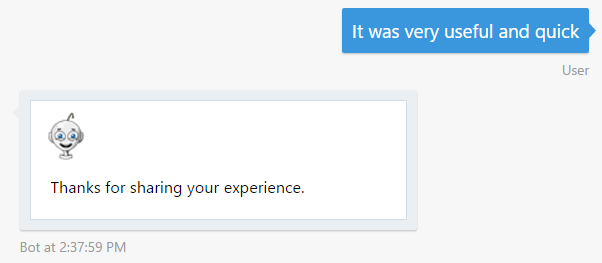

**演習 6: ユーザーのメッセージの背後にあるセンチメントの判別 (C\#)**

**概要**

ユーザーとボットとの対話はほとんどの場合自由形式で行われるため、ボットは言語を自然に、かつ文脈に応じて理解する必要があります。この演習では、Azure
Text Analytics API を使用してユーザーの感情や気分を検出する方法を学習します。

Azure Cognitive Services オファリングの一部である [Text Analytics
API](https://azure.microsoft.com/ja-jp/services/cognitive-services/text-analytics/)
を使用することによって、センチメント、キー
フレーズ、トピック、および言語をテキストから検出できます。この API は 0 ～ 1
の数字によるスコアを返します。1 に近いスコアは肯定的なセンチメントを、0
に近いスコアは否定的なセンチメントを示します。センチメント
スコアは、分類の手法により生成されます。

[こちらのフォルダー](https://github.com/GeekTrainer/help-desk-bot-lab/blob/develop/CSharp/exercise6-MoodDetection)内には、この演習のステップで作成するコードを含むソリューションが入っています。このソリューションは、演習を進めるにあたってさらにヒントが必要な場合に、ガイダンスとして使用できます。このソリューションを使用する場合は、必ず事前に
Web.config で値を設定してください。

**前提条件**

この演習を完了するには、以下のソフトウェアが必要です。

-   [Visual Studio 2017 Community](https://www.visualstudio.com/downloads) 以上

-   [Azure](https://azureinfo.microsoft.com/us-freetrial.html?cr_cc=200744395&wt.mc_id=usdx_evan_events_reg_dev_0_iottour_0_0)
    サブスクリプション

-   [Bot Framework Emulator](https://emulator.botframework.com/) (en-US
    ロケールで構成されていることを確認してください)

**タスク 1: Text Analytics API キーの作成**

このタスクでは、Text Analytics アカウントを作成します。

1.  [こちら](https://azure.microsoft.com/ja-jp/try/cognitive-services/)を参照して、[言語]
    タブをクリックします。Text Analytics API を見つけて [作成]
    をクリックします。使用条件に同意し、国を選択するように求められます。次に、[次へ]
    をクリックします。

2.  **Azure サブスクリプション アカウント**でログインします。1 か月あたり 5,000
    の無料要求が可能な評価キーを含む次のようなページが表示されます。後で使用できるように、キーの
    1 つを保存しておきます。

>   

**タスク 2: Text Analytics API クライアントの追加**

このタスクでは、ボットから **Text Analytics API**
を呼び出す新しいクラスを作成します。

1.  演習 4
    から得られたソリューションを開きます。または、[exercise4-KnowledgeBase](https://github.com/GeekTrainer/help-desk-bot-lab/blob/develop/CSharp/exercise4-KnowledgeBase)
    フォルダーにあるアプリを使用することもできます。

>   **注:**
>   あらかじめ提供しているソリューションを使用する場合は、必ず以下の値を置き換えてください。

-   Dialogs\\RootDialog.cs 内の **[LuisModel("{LUISAppID}", "{LUISKey}")]**
    属性を自分が使用している LUIS アプリ ID とプログラマティック API
    キーに置き換えます。

-   Web.config 内の **AzureSearchAccount**、**AzureSearchIndex**、および
    **AzureSearchKey** を、自分の Search
    アカウント、インデックス名、およびキーに置き換えます (演習 4
    で説明しています)。

1.  プロジェクトの [Services] フォルダー内の
    [TextAnalyticsService.cs](https://github.com/GeekTrainer/help-desk-bot-lab/blob/develop/assets/exercise6-MoodDetection/TextAnalyticsService.cs)
    をコピーします。このファイルには、Text Analytics API を使用する 3
    つのクラスが含まれています。

>   **注:** クライアントは /sentiment エンドポイントにアクセスしていますが、Text
>   Analytics API は /keyPhrases エンドポイントと /languages
>   エンドポイントも提供します。また、複数のドキュメントを分析用に送信できます。

1.  プロジェクトのルート フォルダーにある Web.Config ファイルの **appSettings**
    セクションでキー **TextAnalyticsApiKey**
    を追加することによって、このファイルを更新します。TextAnalyticsApiKey
    の値として、前のタスクで得られた **Text Analytics キー**を設定します。

>   \<add key="TextAnalyticsApiKey" value="" /\>

1.  次のボイラープレート コードを使用して、[Dialogs] フォルダーに新しいクラス
    UserFeedbackRequestDialog.cs
    を作成します。このダイアログは、サービスとの対話を処理する役割を担います。

2.  namespace HelpDeskBot.Dialogs

3.  {

4.  using System;

5.  using System.Collections.Generic;

6.  using System.Threading.Tasks;

7.  using Microsoft.Bot.Builder.Dialogs;

8.  using Microsoft.Bot.Connector;

9.  using Services;

10. [Serializable]

11. public class UserFeedbackRequestDialog : IDialog\<object\>

12. {

13. private readonly TextAnalyticsService textAnalyticsService = new
    TextAnalyticsService();

14. public async Task StartAsync(IDialogContext context)

15. {

16. }

17. }

>   }

1.  StartAsync
    メソッドの実装を、そのボットに関するフィードバックの提供をユーザーに求めるものに置き換えます。

2.  public async Task StartAsync(IDialogContext context)

3.  {

4.  PromptDialog.Text(context, this.MessageReciveAsync, "Can you please give me
    feedback about this experience?");

>   }

1.  MessageReciveAsync
    という新しいメソッドを追加します。このメソッドは、ユーザーの応答を受け取って
    Text Analytics API に送ります。それにより、この API
    でユーザーのセンチメントを評価できるようにします。応答内容 (スコアが 0.5
    より高いか、低いか) に応じて異なるメッセージがユーザーに表示されます。

2.  public async Task MessageReciveAsync(IDialogContext context,
    IAwaitable\<string\> result)

3.  {

4.  var response = await result;

5.  double score = await this.textAnalyticsService.Sentiment(response);

6.  if (score == double.NaN)

7.  {

8.  await context.PostAsync("Ooops! Something went wrong while analyzing your
    answer. An IT representative agent will get in touch with you to follow up
    soon.");

9.  }

10. else

11. {

12. string cardText = string.Empty;

13. string cardImageUrl = string.Empty;

14. if (score \< 0.5)

15. {

16. cardText = "I understand that you might be dissatisfied with my assistance.
    An IT representative will get in touch with you soon to help you.";

17. cardImageUrl =
    "https://raw.githubusercontent.com/GeekTrainer/help-desk-bot-lab/develop/assets/botimages/head-sad-small.png";

18. }

19. else

20. {

21. cardText = "Thanks for sharing your experience.";

22. cardImageUrl =
    "https://raw.githubusercontent.com/GeekTrainer/help-desk-bot-lab/develop/assets/botimages/head-smiling-small.png";

23. }

24. var msg = context.MakeMessage();

25. msg.Attachments = new List\<Attachment\>

26. {

27. new HeroCard

28. {

29. Text = cardText,

30. Images = new List\<CardImage\>

31. {

32. new CardImage(cardImageUrl)

33. }

34. }.ToAttachment()

35. };

36. await context.PostAsync(msg);

37. }

38. context.Done\<object\>(null);

>   }

>   **注:**
>   センチメント分析では、テキストを文に分割することをお勧めします。一般に、この分割によって、センチメント予測の精度が向上します。

**タスク 3:
フィードバックを要求してユーザーのセンチメントを分析できるようにするためのボットの変更**

1.  [Dialogs] フォルダー内の RootDialog.cs
    を開きます。IssueConfirmedMessageReceivedAsync
    メソッドを見つけます。ユーザーによるチケット確認時のコード
    ブロックを更新します。ユーザーがチケットを確認したら
    UserFeedbackRequestDialog
    ダイアログを呼び出し、ユーザーにフィードバックを要求するようにします。また、最後の
    else 内にある context.Done\<object\>(null);
    を移動します。その結果、次のようなコードになります。

2.  private async Task IssueConfirmedMessageReceivedAsync(IDialogContext
    context, IAwaitable\<bool\> argument)

3.  {

4.  var confirmed = await argument;

5.  if (confirmed)

6.  {

7.  ...

8.  if (ticketId != -1)

9.  {

10. ...

11. }

12. else

13. {

14. await context.PostAsync("Ooops! Something went wrong while I was saving your
    ticket. Please try again later.");

15. }

16. context.Call(new UserFeedbackRequestDialog(), this.ResumeAndEndDialogAsync);

17. }

18. else

19. {

20. await context.PostAsync("Ok. The ticket was not created. You can start again
    if you want.");

21. context.Done\<object\>(null);

22. }

>   }

**タスク 4: エミュレーターからのボットのテスト**

1.  [実行]
    ボタンをクリックしてアプリを実行し、エミュレーターを開きます。ボットの URL
    (http://localhost:3979/api/messages) をいつもどおり入力します。

2.  「I need to reset my
    password.」と入力し、次に重大度を選択します。チケットの送信を確認し、フィードバックについての新たな要求をチェックします。

>   

1.  「It was very useful and
    quick.」と入力します。肯定的なフィードバックだったことを意味する次のような応答が表示されます。

>   

1.  チケットの送信をもう一度行い、ボットからフィードバックを求められたら、「It
    was useless and time
    wasting.」と入力します。否定的なフィードバックだったことを意味する次のような応答が表示されます。

>   

>   この後の演習 (7) では、会話を人間の担当者に引き渡し
>   (ハンドオフ)、担当者を通じてユーザーを支援する方法について学習します。

**その他の課題**

自主的に学習を続ける場合は、次のタスクを利用できます。

-   Microsoft Cognitive Services
    内の別のサービスを使用して、ボットに音声認識機能を追加できます。[Bing Speech
    API](https://azure.microsoft.com/ja-jp/services/cognitive-services/speech/)
    を試してみてください。
