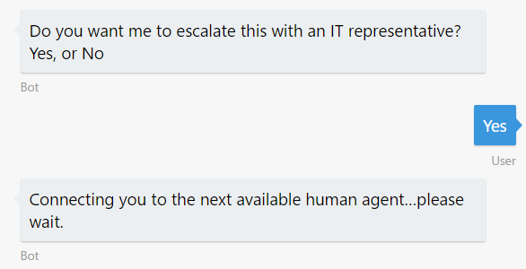
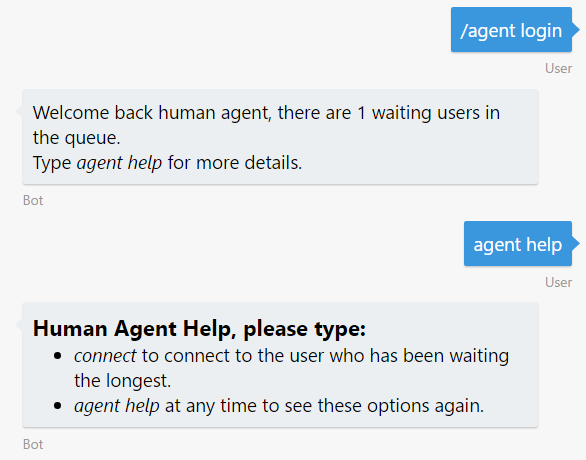
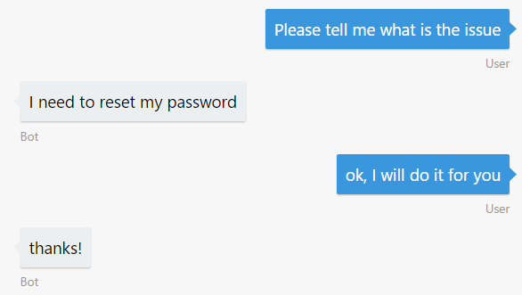

# 演習 7: ヒューマン エージェントへの会話のハンドオフ (C\#)

## 概要

ボットが持つ人工知能の能力がどんなに大きくても、まだ会話を人間にハンドオフしなければならない状況が発生することがあります。たとえば、質問に自動的に返信し、場所を問わずお客様に対応できる一方で、問題を人間にエスカレートできるボットを構築する必要があるでしょう。またボットがすべての状況に対応できない場合や、エッジケースが存在する場合、ボットは適切な権限を持つ人間にその対応を任せることができなければなりません。ボットはハンドオフが必要なタイミングを認識し、明確かつスムーズなハンドオフを実現する必要があります。この演習では、ボットを利用してユーザーと会話を開始し、コンテキストをヒューマン
エージェントにハンドオフする方法を学習します。

最初に、Scorable
を使用して送受信イベント/メッセージをインターセプトする方法を学習します。これを使用して、ユーザーとエージェント間の通信およびエージェントのみで利用できる特別なコマンドを処理します。後半では、新しい
Scorable を使用するようにボットを変更し、ボットの会話をヒューマン
エージェントにハンドオフするダイアログを追加します。

[こちらのフォルダー](./exercise7-HandOffToHuman)内には、この演習で作成するコードを含むソリューションが入っています。このソリューションは、演習を進めるにあたってさらにヒントが必要な場合に、ガイダンスとして使用できます。Scorable
を使用する場合は、最初に Web.config でキーを作成する必要があります。

この演習で使用するハンドオフ アプローチの詳細については、[BUILD
2017](https://channel9.msdn.com/Events/Build/2017/P4075)
のこちらのセッションを参照してください。

この図は、この演習用のボットのコンポーネントを簡単に示しています。


## 前提条件

この演習を完了するには、以下のソフトウェアが必要です。

-   [Visual Studio 2017 Community](https://www.visualstudio.com/downloads) 以上

-   [Azure](https://azureinfo.microsoft.com/us-freetrial.html?cr_cc=200744395&wt.mc_id=usdx_evan_events_reg_dev_0_iottour_0_0)
    サブスクリプション

-   [LUIS ポータル](https://www.luis.ai/)のアカウント

-   [Bot Framework Emulator](https://emulator.botframework.com/) (en-US
    ロケールで構成されていることを確認してください)

## タスク 1: ハンドオフ ロジックの構築

このタスクでは、2 人の人物 (ユーザーとエージェント)
を橋渡しする通信を処理するために必要な "裏側"
のロジックを追加します。送受信イベント/メッセージをインターセプトする Scorable
を作成して配置する方法を学習します。

Bot Builder SDK for .NET の Scorable
により、ボットは会話に送信されるすべてのメッセージをインターセプトし、定義されたロジックに基づいてメッセージにスコアを適用できます。Scorable
を作成するには、ScorableBase 抽象クラスを継承して、IScorable
インターフェイスを実装するクラスを作成します。その Scorable
を会話内のすべてのメッセージに適用するために、ボットはその IScorable
インターフェイスをサービスとして会話のコンテナに登録します。新しいメッセージが会話に届くと、そのメッセージはコンテナ内の
IScorable
の各実装に渡され、スコアを取得します。次にそのメッセージは、コンテナから最も高いスコアを持つ
IScorable に渡されて処理されますScorable
の詳細については、[こちらのサンプル](https://github.com/Microsoft/BotBuilder-Samples/tree/master/CSharp/core-GlobalMessageHandlers)を参照してください。

1.  前の演習から得られたアプリを開きます。または、[exercise6-MoodDetection](./exercise6-MoodDetection)
    フォルダーにあるアプリを使用することもできます。

    > **注:** あらかじめ提供しているソリューションを使用する場合は、必ず以下の値を置き換えてください。
    > -   RootDialog.cs 内の **[LuisModel("{LUISAppID}", "{LUISKey}")]** 属性のプレースホルダーを、自分が使用している LUIS アプリ ID とプログラマティック API キーに置き換えます
    > -   Web.config 内の **TextAnalyticsApiKey** を、自分が使用している Text Analytics キーに置き換えます (演習 6 で説明しています)。
    > -   Web.config 内の **AzureSearchAccount**、**AzureSearchIndex**、および **AzureSearchKey** を、自分の Search アカウント、インデックス名、およびキーに置き換えます (演習 4 で説明しています)。

2.  プロジェクトに HandOff
    フォルダーを作成し、[assets](../assets)
    フォルダーの次のファイルを追加します。

    -   [AgentExtensions.cs](../assets/exercise7-HandOffToHuman/AgentExtensions.cs)
    
    通常ユーザーをエージェントに切り替え、エージェントを識別する、シンプルなロジックが含まれています。これを使用して、いずれは、会話、ユーザー、およびエージェントを管理する独自のロジックを実装できます。

    -   [Provider.cs](../assets/exercise7-HandOffToHuman/Provider.cs)
    
    ヒューマン エージェントとの通信を待つユーザーを入れるキューを作成します。このクラスでは、外部ストレージでキューを存続させません。これは、会話のメタデータを格納する場所でもあります。会話をデータ ストアに格納する場合は、カスタムの実装で Provider を更新するか、カスタムの実装を含む Provider を継承できます。

    -   [CommandScorable.cs](../assets/exercise7-HandOffToHuman/CommandScorable.cs)
    
    この Scorable はメッセージがエージェントからの場合にアクセスされ、agent help、connect、または resume メッセージを受信した場合に限り、その解決をトリガーします。ユーザーのメッセージがこれらのメッセージと一致しない場合、ユーザーのメッセージはこの Scorable で処理されません。

3.  次のボイラープレート コードを使用して、RouterScorable.cs クラスを HandOff
    フォルダーに作成します。ルーターには、各メッセージがエージェントまたはユーザーのどちらに送信される必要があるかを把握する役割があります。

    ```CSharp
    namespace HelpDeskBot.HandOff
    {
        using System;
        using System.Threading;
        using System.Threading.Tasks;
        using Microsoft.Bot.Builder.Dialogs.Internals;
        using Microsoft.Bot.Builder.Internals.Fibers;
        using Microsoft.Bot.Builder.Scorables.Internals;
        using Microsoft.Bot.Connector;

        public class RouterScorable : ScorableBase<IActivity, ConversationReference, double>
        {
            private readonly ConversationReference conversationReference;
            private readonly Provider provider;
            private readonly IBotData botData;

            public RouterScorable(IBotData botData, ConversationReference conversationReference, Provider provider)
            {
                SetField.NotNull(out this.botData, nameof(botData), botData);
                SetField.NotNull(out this.conversationReference, nameof(conversationReference), conversationReference);
                SetField.NotNull(out this.provider, nameof(provider), provider);
            }

            protected override Task DoneAsync(IActivity item, ConversationReference state, CancellationToken token)
            {
                return Task.CompletedTask;
            }
        }
    }
    ```

4.  PrepareAsync、PrepareRouteableAgentActivity、および
    PrepareRouteableUserActivity メソッドを RouterScorable.cs に追加します。
    
    PrepareAsync メソッドは受信メッセージを受け取り、他のメソッドをいくつか呼び出して解決をトリガーします。

    ```CSharp
    namespace HelpDeskBot.HandOff
    {
        using System;
        using System.Threading;
        using System.Threading.Tasks;
        using Microsoft.Bot.Builder.Dialogs.Internals;
        using Microsoft.Bot.Builder.Internals.Fibers;
        using Microsoft.Bot.Builder.Scorables.Internals;
        using Microsoft.Bot.Connector;

        public class RouterScorable : ScorableBase<IActivity, ConversationReference, double>
        {
            private readonly ConversationReference conversationReference;
            private readonly Provider provider;
            private readonly IBotData botData;

            public RouterScorable(IBotData botData, ConversationReference conversationReference, Provider provider)
            {
                SetField.NotNull(out this.botData, nameof(botData), botData);
                SetField.NotNull(out this.conversationReference, nameof(conversationReference), conversationReference);
                SetField.NotNull(out this.provider, nameof(provider), provider);
            }

            protected override Task DoneAsync(IActivity item, ConversationReference state, CancellationToken token)
            {
                return Task.CompletedTask;
            }
        }
    }
    ```
    
    PrepareRouteableAgentActivity は、メッセージが通常ユーザーと接続されているエージェントからのものであれば、Scorable をトリガーします。

    ```CSharp
    protected ConversationReference PrepareRouteableAgentActivity(string conversationId)
    {
        var conversation = this.provider.FindByAgentId(conversationId);
        return conversation?.User;
    }
    ```
    
    PrepareRouteableUserActivity は、メッセージが、エージェントとの通信を待機している通常ユーザーかエージェントに接続されている通常ユーザーからのものであれば、Scorable をトリガーします。

    ```CSharp
    protected ConversationReference PrepareRouteableUserActivity(string conversationId)
    {
        var conversation = this.provider.FindByConversationId(conversationId);
        if (conversation == null)
        {
            conversation = this.provider.CreateConversation(this.conversationReference);
        }

        switch (conversation.State)
        {
            case ConversationState.ConnectedToBot:
                return null; // continue normal flow
            case ConversationState.WaitingForAgent:
                return conversation.User;
            case ConversationState.ConnectedToAgent:
                return conversation.Agent;
        }

        return null;
    }
    ```

5.  HasScore および GetScore メソッドを RouterScorable.cs に追加します。HasScore
    は、PrepareAsync が有効な ConversationReference を返し、GetScore
    が最大スコアを返してメッセージを解決する場合に限り、評価されます。

    ```CSharp
    protected override bool HasScore(IActivity item, ConversationReference destination)
    {
        return destination != null;
    }

    protected override double GetScore(IActivity item, ConversationReference destination)
    {
        return 1.0;
    }
    ```

6.  PostAsync メソッドを RouterScorable.cs に追加します。この Scorable
    がメッセージの解決に成功したら、ConversationReference
    はメッセージの宛先を受信します。宛先が現在の会話と同じユーザーである場合、Scorable
    はそのユーザーにメッセージを送信して、キューの状態を通知します。それ以外の場合、Scorable
    は受信メッセージを宛先にルーティングします。

    ```CSharp
    protected override async Task PostAsync(IActivity item, ConversationReference destination, CancellationToken token)
    {
        string textToReply;
        if (destination.Conversation.Id == conversationReference.Conversation.Id)
        {
            textToReply = "Connecting you to the next available human agent... please wait";
        }
        else
        {
            textToReply = item.AsMessageActivity().Text;
        }

        ConnectorClient connector = new ConnectorClient(new Uri(destination.ServiceUrl));
        var reply = destination.GetPostToUserMessage();
        reply.Text = textToReply;
        await connector.Conversations.SendToConversationAsync(reply);
    }
    ```

## タスク 2: ボットを更新して会話をハンドオフ

このタスクでは、ルーティングを行う Scorable
に接続するようにボットを更新し、会話のハンドオフ
フローを処理するために必要なダイアログを追加します。

1.  [LUIS ポータル](https://www.luis.ai/)を開き、次の発話を含む
    **HandOffToHuman** インテントを追加するようにアプリを編集します。

    -   *I want to talk to an IT representative*

    -   *Contact me to a human being*

    -   *Operator*
    
    必要に応じて、[こちらの LUIS モデル](../assets/exercise7-HandOffToHuman/luis_model.json)をインポートして使用できます。

2.  アプリをトレーニングして再度発行します。

3.  [assets](../assets)
    フォルダーにある
    [AgentLoginScorable.cs](../assets/exercise7-HandOffToHuman/AgentLoginScorable.cs)
    を Dialogs フォルダーにコピーします。このクラスは、通常ユーザーとヒューマン
    エージェント間の切り替えを管理します。

4.  Global.asax.cs を開き、次の using ステートメントを追加します。

    ```csharp
    using HandOff;
    using Microsoft.Bot.Builder.Dialogs.Internals;
    ```

5.  Global.asax.cs で、2 ユーザー間の通信を処理するために、新しい IScorable
    の実装の登録を追加します。

    ```csharp
    protected void Application_Start()
    {
        GlobalConfiguration.Configure(WebApiConfig.Register);

        var builder = new ContainerBuilder();

        // Hand Off Scorables, Provider and UserRoleResolver
        builder.Register(c => new RouterScorable(c.Resolve<IBotData>(), c.Resolve<ConversationReference>(), c.Resolve<Provider>()))
            .As<IScorable<IActivity, double>>().InstancePerLifetimeScope();
        builder.Register(c => new CommandScorable(c.Resolve<IBotData>(), c.Resolve<ConversationReference>(), c.Resolve<Provider>()))
            .As<IScorable<IActivity, double>>().InstancePerLifetimeScope();
        builder.RegisterType<Provider>()
            .SingleInstance();

        // Bot Scorables
        builder.Register(c => new AgentLoginScorable(c.Resolve<IBotData>(), c.Resolve<Provider>()))
            .As<IScorable<IActivity, double>>()
            .InstancePerLifetimeScope();
        builder.RegisterType<SearchScorable>()
            .As<IScorable<IActivity, double>>()
            .InstancePerLifetimeScope();
        builder.RegisterType<ShowArticleDetailsScorable>()
            .As<IScorable<IActivity, double>>()
            .InstancePerLifetimeScope();

        builder.Update(Microsoft.Bot.Builder.Dialogs.Conversation.Container);
    }
    ```

6.  RootDialog.cs で、HandOffToHuman
    インテントを処理し、エージェントと通信するためのキューにユーザーを入れる
    HandOff メソッドを追加します。

    ```CSharp
    [LuisIntent("HandOffToHuman")]
    public async Task HandOff(IDialogContext context, LuisResult result)
    {
        var conversationReference = context.Activity.ToConversationReference();
        var provider = Conversation.Container.Resolve<HandOff.Provider>();

        if (provider.QueueMe(conversationReference))
        {
            var waitingPeople = provider.Pending() > 1 ? $", there are { provider.Pending() - 1 } users waiting" : string.Empty;

            await context.PostAsync($"Connecting you to the next available human agent... please wait{waitingPeople}.");
        }

        context.Done<object>(null);
    }
    ```

7.  さらに次の using ステートメントを使用します。

    ```csharp
    using Autofac;
    using Microsoft.Bot.Builder.ConnectorEx;
    ```

8.  UserFeedbackRequestDialog.cs で、ユーザーの満足度スコアが 0.5
    未満の場合に、前のステップで作成された Handoff
    ダイアログを呼び出すように、MessageReceivedAsync
    メソッドを更新します。簡単にするために、メソッド全体を次のコード (2
    つのメソッド) で置き換えることができます。

    ```CSharp
    public async Task MessageReceivedAsync(IDialogContext context, IAwaitable<string> result)
    {
        var response = await result;

        double score = await this.textAnalyticsService.Sentiment(response);

        if (score == double.NaN)
        {
            await context.PostAsync("Ooops! Something went wrong while analying your answer. An IT representative agent will get in touch with you to follow up soon.");
        }
        else
        {
            string cardText = string.Empty;
            string cardImageUrl = string.Empty;

            if (score < 0.5)
            {
                cardText = "I understand that you might be dissatisfied with my assistance. An IT representative will get in touch with you soon to help you.";
                cardImageUrl = "https://raw.githubusercontent.com/GeekTrainer/help-desk-bot-lab/master/assets/botimages/head-sad-small.png";
            }
            else
            {
                cardText = "Thanks for sharing your experience.";
                cardImageUrl = "https://raw.githubusercontent.com/GeekTrainer/help-desk-bot-lab/master/assets/botimages/head-smiling-small.png";
            }

            var msg = context.MakeMessage();
            msg.Attachments = new List<Attachment>
            {
                new HeroCard
                {
                    Text = cardText,
                    Images = new List<CardImage>
                    {
                        new CardImage(cardImageUrl)
                    }
                }.ToAttachment()
            };
            await context.PostAsync(msg);

            if (score < 0.5)
            {
                var text = "Do you want me to escalate this with an IT representative?";
                PromptDialog.Confirm(context, this.EscalateWithHumanAgent, text);
            }
            else
            {
                context.Done<object>(null);
            }
        }
    }

    private async Task EscalateWithHumanAgent(IDialogContext context, IAwaitable<bool> argument)
    {
        var confirmed = await argument;

        if (confirmed)
        {
            var conversationReference = context.Activity.ToConversationReference();
            var provider = Conversation.Container.Resolve<HandOff.Provider>();

            if (provider.QueueMe(conversationReference))
            {
                var waitingPeople = provider.Pending() > 1 ? $", there are { provider.Pending() - 1 } users waiting" : string.Empty;

                await context.PostAsync($"Connecting you to the next available human agent... please wait{waitingPeople}.");
            }

        }

        context.Done<object>(null);
    }
    ```

9.  さらに次の using ステートメントを使用します。

    ```csharp
    using Autofac;
    using Microsoft.Bot.Builder.ConnectorEx;
    ```

**タスク 3: エミュレーターからのボットのテスト**

1.  [実行] ボタンをクリックしてアプリを実行し、エミュレーターの 2
    つのインスタンスを開きます。両方にボットの URL
    (http://localhost:3979/api/messages ) をいつもどおり入力します。

2.  1 つのエミュレーターで、「I need to reset my password, this is
    urgent」と入力して、新しいチケットを作成し、送信を確認します。ボットからフィードバックを求められたら、「it
    was
    useless」などの否定的なフレーズを入力します。エージェントと話すかどうかを尋ねる、新しいプロンプトが表示されるはずです。

    

3.  待機ユーザーのキューにユーザーを入れるためのプロンプトを確認します。

   

4.  2 つ目のエミュレーターでは、「/agent
    login」と入力して、エージェントの権限を制御します。ボットから、1
    人のユーザーが待機中であることが通知されるはずです。「agent
    help」と入力すると、エージェントの選択肢を含むメッセージが表示されます。
    
    

5.  「connect」と入力して、ユーザーとの会話を開始します。1
    番目のエミュレーターでは、ボットがこの接続をユーザーに通知します。

    | **エージェントのメッセージ**             | **ユーザーのメッセージ**                 |
    |------------------------------------------|------------------------------------------|
    |  |  |

6.  エミュレーターを使用して、エージェントとユーザー間の通信を確認できるようになりました。

    | **エージェントのメッセージ**             | **ユーザーのメッセージ**                 |
    |------------------------------------------|------------------------------------------|
    |  |  |

7.  対話を終了するには、2 番目のエミュレーター (エージェント エミュレーター)
    で「resume」と入力します。ボットから両方の参加者に通信の終了が通知されます。

    | **エージェントのメッセージ**             | **ユーザーのメッセージ**                   |
    |------------------------------------------|--------------------------------------------|
    |  |  |

    > **注:** もう 1 つの考えられるシナリオは "管理されたハンドオフ" です。このケースでは、ボットがユーザーの質問に応じてヒューマン エージェントと通信し、ボットが用意しているどの答えが正しいかを尋ねます。

## その他の課題

自主的に学習を続ける場合は、次のタスクを利用できます。

-   Cosmos DB や SQL Server などの外部データ
    ストアに会話データを格納するカスタム プロバイダーを作成します。

-   AgentLoginScorable
    の認証を追加します。ユーザーの認証プロセスを起動するには、[Sign-inCard](https://docs.botframework.com/en-us/csharp/builder/sdkreference/dc/d03/class_microsoft_1_1_bot_1_1_connector_1_1_signin_card.html)
    を追加する必要があります。

-   [Provider.cs](../assets/exercise7-HandOffToHuman/Provider.cs)
    を変更して、会話データが持続されるようにします。現状では、アクティブな会話はメモリ内に格納され、ボットの拡大/縮小は困難です。

-   ルーターに新しい状態を実装して、会話を監視できます。この場合、ユーザーとボットのメッセージはヒューマン
    エージェントに送信され監視されます。

-   ボットは、人間の応答を待機中、既定の応答を使用して、すべての受信ユーザー
    メッセージに自動的に対応します。"never mind" や "cancel"
    などの特定のメッセージをユーザーが送信した場合、ボットに "待機"
    状態から会話を削除させることができます。

-   ハンドオフの別の方法として、ヘルプ
    ダイアログに、会話を人間にハンドオフするボタンを追加します。
