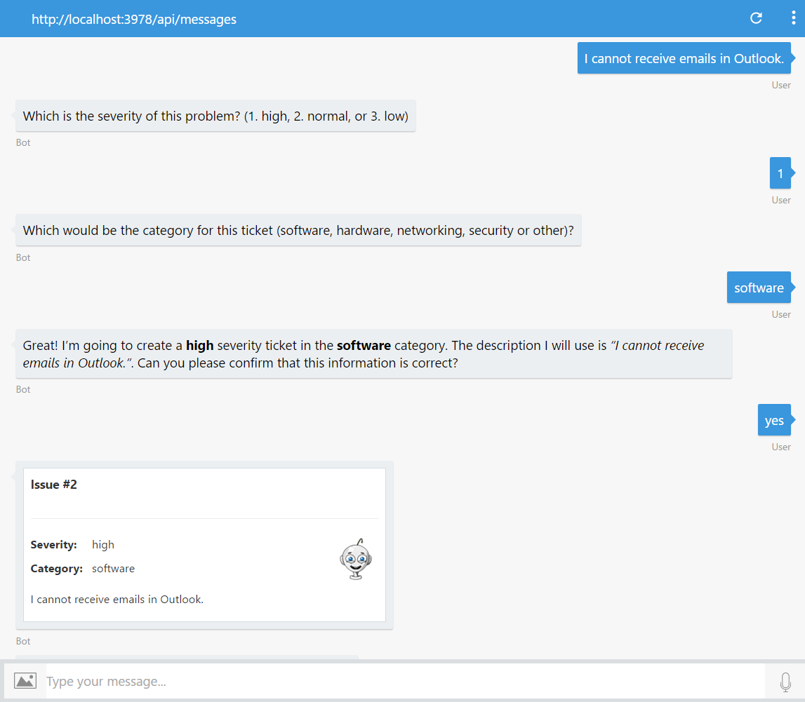

# 演習 2: ボットによるヘルプ デスク チケットの送信

この演習では、ボットに会話機能を追加して、ヘルプ デスク
チケットの作成をユーザーに案内する方法を学習します。

こちらの
[C\#](https://github.com/GeekTrainer/help-desk-bot-lab/blob/develop/CSharp/exercise2-TicketSubmissionDialog)
または
[Node.js](https://github.com/GeekTrainer/help-desk-bot-lab/blob/develop/Node/exercise2-TicketSubmissionDialog)
のフォルダー内には、この演習のステップの完了結果として得られるコードを含むソリューションが入っています。このソリューションは、演習を進めるにあたってさらにヒントが必要な場合に、ガイダンスとして使用できます。

## 目標

この演習を完了するためには、ボットが以下のタスクを実行できなければなりません。

-   ユーザーにボットの現在の機能を伝える。

-   問題に関する情報をユーザーに求める。

-   インメモリ API を作成して、チケット情報を保存する。

ボットとの会話のサンプルを次に示します。

## 前提条件

-   前の演習を完了していること、あるいは
    [C\#](https://github.com/GeekTrainer/help-desk-bot-lab/blob/develop/CSharp/exercise1-EchoBot)
    または
    [Node.js](https://github.com/GeekTrainer/help-desk-bot-lab/blob/develop/Node/exercise1-EchoBot)
    用の開始点を使用できること。

-   [Visual Studio Code](https://code.visualstudio.com/download) (推奨) や
    Visual Studio 2017 Community 以上などのコード エディター

## ユーザーへのボットの紹介

ボットを作成する際は必ず、ユーザーに使用可能なオプションについて知らせる必要があります。これは、会話ベースのインターフェイスでの操作で、ユーザーがボットに指示を出す場合に、特に重要です。

## チケット詳細のプロンプト

ヘルプ デスク チケットには、以下の情報を保存する必要があります。

-   重要度

    -   高

    -   標準

    -   低

-   カテゴリ

    -   ソフトウェア

    -   ハードウェア

    -   ネットワーク

    -   セキュリティ

-   説明

ボットで情報を収集する順序は任意です。以下を使用できます。

-   ウォーターフォール パターンの会話フロー

-   Prompts.choice() と Prompts.text()
    でチケットの重大度とカテゴリについて尋ねます。

-   Prompts.confirm() で、チケットの情報が正しいことを確認します。

**インメモリ チケット API**

Node.js では [Restify](http://restify.com/)、C\# では [Web
API](https://www.asp.net/web-api) を使用して、基本的な HTTP
エンドポイントを作成し、チケットをメモリに保存します。このエンドポイントでは、メッセージ本文としてのチケットを含む
POST 呼び出しを受け入れる必要があります。

今回は演習を目的としているため、**データベースまたはその他の外部データストアを使用しない**ことが必要なので、データは単純にアレイまたはリストに保存します。エンドポイントは、ボットをホストするのと同じ
Web アプリケーションの一部である必要があります。

> **注:**
アプリケーションを実稼働環境に展開する際は、エンドポイントを別のアプリケーションに分離することも可能です。通常は、既存の
API を呼び出します。

## アダプティブ カード

[アダプティブ
カード](http://adaptivecards.io/)を使用して、チケットの詳細を表示することもできます。

-   Node.js
    の場合は、[こちら](https://docs.microsoft.com/en-us/bot-framework/rest-api/bot-framework-rest-connector-add-rich-cards#adaptive-card)で説明するように、このハンズオン
    ラボの
    [assets](https://github.com/GeekTrainer/help-desk-bot-lab/blob/develop/assets)
    フォルダーの
    [ticket.json](https://github.com/GeekTrainer/help-desk-bot-lab/blob/develop/assets/exercise2-TicketSubmissionDialog/ticket.json)
    ファイルを使用できます。

-   C\#
    の場合は、[こちら](https://docs.microsoft.com/en-us/bot-framework/dotnet/bot-builder-dotnet-add-rich-card-attachments#a-idadaptive-carda-add-an-adaptive-card-to-a-message)に示すように、Microsoft.AdaptiveCards
    NuGet パッケージを使用できます。

## その他の課題

自主的に学習を続ける場合は、次のタスクを利用できます。

-   conversationUpdate イベントを使用してボットにウェルカム
    メッセージを送信します。詳細は、[こちら](https://docs.microsoft.com/en-us/bot-framework/nodejs/bot-builder-nodejs-handle-conversation-events#greet-a-user-on-conversation-join)を参照してください。

-   ボットがチケット API を呼び出す間、ボットにタイピング
    インジケーターを送信します。詳細は、[こちら](https://docs.microsoft.com/en-us/bot-framework/nodejs/bot-builder-nodejs-send-typing-indicator)を参照してください。

## 参考資料

-   [Getting started with Web
    API](https://docs.microsoft.com/en-us/aspnet/web-api/overview/getting-started-with-aspnet-web-api/tutorial-your-first-web-api)

-   [Routing in Restify](http://restify.com/#common-handlers-serveruse)

-   [Prompt users for input in
    Node.js](https://docs.microsoft.com/en-us/bot-framework/nodejs/bot-builder-nodejs-dialog-prompt)

-   [Dialogs in the Bot Builder SDK for
    .NET](https://docs.microsoft.com/en-us/bot-framework/dotnet/bot-builder-dotnet-dialogs)
