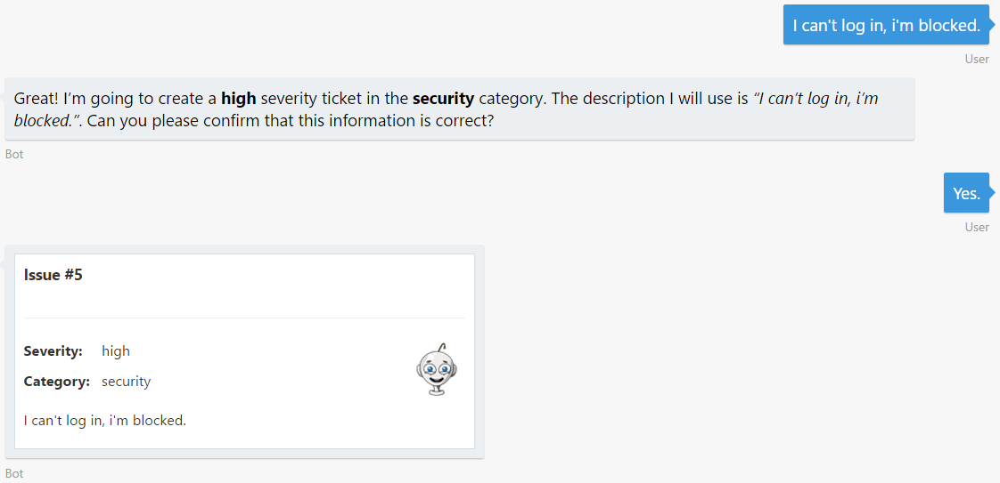

# 演習 3: 言語理解の機能によるボットのスマート化

この演習では、ボットに自然言語理解機能を追加して、ヘルプ デスク
チケットの作成時のユーザー
エクスペリエンスを向上させる方法を学習します。このラボの全体を通して、Azure
Cognitive Services オファリングの一部である LUIS (Language Understanding
Intelligent Service) を使用します。

人間とコンピューターとの対話式操作における大きな問題の 1
つに人間が何を欲しているかをコンピューターが理解する能力が挙げられます。LUIS
は、人間の言語を理解することにより、ユーザーの要求に応じることができるスマート
アプリケーションを開発者が構築できるように設計されています。LUIS
を使用することで、開発者は、HTTP エンドポイントを迅速に展開できます。HTTP
エンドポイントでは、送信された文を取得し、そのインテント
(伝達される意図)、およびエンティティ (インテントに関連する重要な情報)
を解釈します。

この
[C\#](https://github.com/GeekTrainer/help-desk-bot-lab/blob/develop/CSharp/exercise3-LuisDialog)
または
[Node.js](https://github.com/GeekTrainer/help-desk-bot-lab/blob/develop/Node/exercise3-LuisDialog)
のフォルダー内には、この演習のステップの完了結果として得られるコードを含むソリューションが入っています。このソリューションは、演習を進めるにあたってさらにヒントが必要な場合に、ガイダンスとして使用できます。

## 目標

この演習を完了するためには、作成するボットが以下の操作を実行できなければなりません。

-   ユーザーが遭遇している問題を説明する全文の入力が可能であること。システムが次の事項を検出できること。

    -   ユーザーがヘルプ デスク チケットを送信した時点

    -   重大度 (指定されている場合)

    -   カテゴリ (指定されている場合)

-   LUIS モデルを使用するようにボットを更新すること。

**前提条件**

-   前の演習を完了していること、あるいは
    [C\#](https://github.com/GeekTrainer/help-desk-bot-lab/blob/develop/CSharp/exercise2-TicketSubmissionDialog)
    または
    [Node.js](https://github.com/GeekTrainer/help-desk-bot-lab/blob/develop/Node/exercise2-TicketSubmissionDialog)
    用の開始点を使用できること

-   [LUIS ポータル](https://www.luis.ai/)のアカウント

## LUIS を使用した、言語理解機能によるボットのスマート化

エンティティと発話を含み、チケットの重大度とカテゴリ (エンティティ)
とともにユーザーのインテントを認識できる LUIS
モデルを作成する必要があります。ボットとの対話のサンプルを次に示します。

Node.js ではボットに対して LuisRecognizer
を使用する必要があり、このコードによって、ボットがユーザーに確認を求めるときに認識エンジンが制御を取得しないようにします。

var luisRecognizer = new
builder.LuisRecognizer(process.env.LUIS\_MODEL\_URL).onEnabled((context,
callback) =\> {

var enabled = context.dialogStack().length === 0;

callback(null, enabled);

});

bot.recognizer(luisRecognizer);

**注:** 既に LUIS に習熟している場合は、この演習の
[assets](https://github.com/GeekTrainer/help-desk-bot-lab/blob/develop/assets/exercise3-LuisDialog)
フォルダーにあるファイル luis\_model.json
を各自のアカウントにインポートして、モデルをトレーニングおよび発行できます。しかし、LUIS
の初心者である場合は、学習のためにモデルを最初から作成することをお勧めします。

## その他の課題

自主的に学習を続ける場合は、次のタスクを利用できます。

-   SubmitTicket ダイアログにキャンセル イベント ハンドラーを追加する。

-   SubmitTicket 内でユーザーにヘルプを提供するカスタム ダイアログを追加する。

-   cancel が呼び出されない限り、開始された SubmitDialog
    が完了することを保証する。

-   チケットのステータスをボットに要求する機能を追加する。チケットにステータス
    プロパティを追加し、新しいダイアログを起動する LUIS
    アプリの新しいインテントを追加する必要があります。

## 参考資料

-   [Entities in
    LUIS](https://docs.microsoft.com/en-us/azure/cognitive-services/LUIS/luis-concept-entity-types)

-   [Enable language understanding with LUIS in
    .NET](https://docs.microsoft.com/en-us/bot-framework/dotnet/bot-builder-dotnet-luis-dialogs)

-   [Recognize user intent in
    Node.js](https://docs.microsoft.com/en-us/bot-framework/nodejs/bot-builder-nodejs-recognize-intent)
