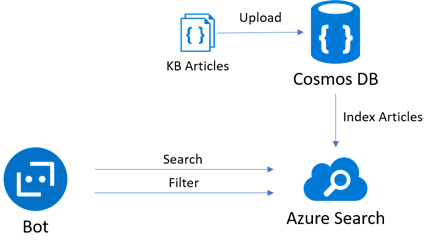

**演習 4: Azure Search と Cosmos DB によるヘルプ デスク ナレッジ ベースの実装**

ボットは、ユーザーが大量のコンテンツをナビゲートする支援を行い、ユーザーのためにデータ駆動型の検索エクスペリエンスを実現することもできます。この演習では、検索機能をボットに追加し、ユーザーがナレッジ
ベースを検索する支援を行う方法について学習します。これを行うには、Azure Cosmos
DB に保管されている KB の記事のインデックスを作成する Azure Search
サービスにボットを接続します。

[Azure Cosmos DB](https://azure.microsoft.com/en-us/services/cosmos-db/)
は、マイクロソフトが提供する、ミッション
クリティカルなアプリケーション向けのグローバル分散型マルチ モデル データベース
サービスです。Azure Cosmos DB は、さまざまなデータ
モデルをサポートします。この演習では、Azure Cosmos DB の DocumentDB API
を使用します。これを使用することで、ナレッジ ベースの記事を JSON
ドキュメントとして保管できます。

[Azure Search](https://azure.microsoft.com/en-us/services/search/) は、カスタム
アプリケーションで充実した検索エクスペリエンスを実現する完全管理型のクラウド検索サービスです。Azure
Search は、さまざまなソース (Azure SQL DB、Cosmos DB、BLOB ストレージ、テーブル
ストレージ) のコンテンツのインデックスを作成でき、その他のデータ
ソースに対応する「プッシュ型」のインデックス作成をサポートします。また、PDF、Office
ドキュメント、および非構造化データが含まれるその他の形式のドキュメントを開くことができます。コンテンツ
カタログが Azure Search
インデックスに取り込まれることで、ボットのダイアログからクエリを行えるようになります。

この
[C\#](https://github.com/GeekTrainer/help-desk-bot-lab/blob/develop/CSharp/exercise4-KnowledgeBase)
または
[Node.js](https://github.com/GeekTrainer/help-desk-bot-lab/blob/develop/Node/exercise4-KnowledgeBase)
のフォルダー内には、この演習のステップの完了結果として得られるコードを含むソリューションが入っています。このソリューションは、演習を進めるにあたってさらにヒントが必要な場合に、ガイダンスとして使用できます。

次の図は、この演習でコンポーネントどうしがどのようなやりとりをするかを示したものです。

**目標**

この演習を完了するためには、ボットが以下の操作を実行できなければなりません。

-   さまざまな記事のカテゴリ
    (ソフトウェア、ハードウェア、ネットワーキング、セキュリティ)
    を一覧表示し、ファセットを通して Azure Search
    からそれらを取得して、「explore knowledge
    base」のような発話に応答します。そして、ユーザーにいずれかを選択するよう求めます。カテゴリが入力されている場合は、そのカテゴリに属する記事を一覧表示します。

-   ユーザーが「explore
    hardware」と入力した場合は、カテゴリについて尋ねず、ハードウェア
    カテゴリに属する記事を一覧表示します (LUIS
    の言語理解機能がこれに使用されます)。

-   ボットによって示される記事にはそれぞれ [More Details]
    ボタンが付いており、これを押すと、記事のコンテンツが表示されます。

-   ユーザーが「show me the article Turn off OneDrive in windows
    10」と入力した場合は、Azure Search で「Turn off OneDrive in windows
    10」という文字列が含まれる記事を検索します。

-   ユーザーが「search onedrive」と入力した場合は、OneDrive
    というキーワードでナレッジ ベースを検索します。

ボットとの対話のサンプルを次に示します。

**前提条件**

-   前の演習を完了している必要があります。あるいは
    [C\#](https://github.com/GeekTrainer/help-desk-bot-lab/blob/develop/CSharp/exercise3-LuisDialog)
    または
    [Node.js](https://github.com/GeekTrainer/help-desk-bot-lab/blob/develop/Node/exercise3-LuisDialog)
    用の開始点を使用できます。

-   [LUIS ポータル](https://www.luis.ai/)のアカウント

-   [Azure](https://azureinfo.microsoft.com/us-freetrial.html?cr_cc=200744395&wt.mc_id=usdx_evan_events_reg_dev_0_iottour_0_0)
    サブスクリプション

**Azure サービスを作成して構成する**

DocumentDB API を使用して Azure Cosmos DB
を作成した後、新しいコレクションを作成する必要があります。ドキュメント
エクスプローラーを使用して、ナレッジ
ベースのサンプル記事をアップロードします。[assets/kb](https://github.com/GeekTrainer/help-desk-bot-lab/blob/develop/assets/kb)
フォルダーのファイルを使用できます。

次に、Azure Search
サービスを作成します。**データのインポート**機能を使用して、Cosmos DB
でコンテンツのインデックスを作成します。インデックスをカスタマイズする場合は、必ず、次の図のようにフィールドにチェックマークを付けてください。

Azure Search
インデックスの詳細については、[こちらの記事](https://docs.microsoft.com/en-us/azure/search/search-what-is-an-index)を参照してください。

**ExploreKnowledgeBase インテントが含まれるように LUIS モデルを更新する**

ナレッジ ベースを検索するインテントに対応するために、LUIS
モデルに新しいインテントを追加する必要があります。発話の一例を次に示します。

-   「explore knowledge base」

-   「explore hardware articles」

-   「find me articles about hardware」

**Azure Search API を呼び出せるようにボットを更新する**

REST API を使用して Azure Search
に対してクエリを行うためにコードを追加する必要があります。使用する URL
は次のようになります。

https://helpdeskbotsearch.search.windows.net/indexes/knowledge-base-index/docs?api-key=79CF1B7A9XXXXXXXXX5E3532888C&api-version=2015-02-28&{query\_placeholder}

{query\_placeholder} は以下のようになります。

-   \$filter=category eq 'hardware': カテゴリに属する記事を取得します。

-   \$filter='title eq 'some title': タイトルで記事を取得します。

-   search=OneDrive: OneDrive に関する記事を検索します。

-   facet=category:
    カテゴリ、およびそのカテゴリに属する記事の数を一覧表示します。

詳細については、以下の記事を参照してください。

-   [Azure Search
    インデックスの照会](https://docs.microsoft.com/en-us/azure/search/search-query-overview)

-   [OData Expression Syntax for Azure
    Search](https://docs.microsoft.com/en-us/rest/api/searchservice/odata-expression-syntax-for-azure-search)

**カテゴリと記事を表示できるようにボットを更新する**

ボットのダイアログはさまざまな方法で実装できます。ここでは、各言語で推奨される方法について説明します。

Node.js の場合は、以下のダイアログを追加します。

-   SearchKB ダイアログ。正規表現 /\^search about (.\*)/i
    のマッチングを行い、search=... クエリを使用して Azure Search でフリー
    テキスト検索を行います。

-   ExploreKnowledgeBase ダイアログ。2 つのウォーターフォール
    ステップで「explore {category}」の発話に対応します。最初のステップでは、LUIS
    によって検出されたカテゴリの取得を試みます。検出されなかった場合は、Azure
    Search からカテゴリの一覧を取得し、builder.Prompts.choice()
    を使用してユーザーにそれらを示します。2
    つ目のウォーターフォールでは、\$filter=category eq '{category}'
    クエリを使用して記事カテゴリで検索を行います。結果は、新しい ShowKBResults
    ダイアログで表示されます。

-   ShowKBResults ダイアログ。builder.ThumbnailCard(session)
    のカルーセルを使用して各記事を表示します。カルーセルを表示するには、builder.Message(session).attachmentLayout(builder.AttachmentLayout.carousel);
    を使用する必要があります。

-   3 つ目の DetailsOf ダイアログ。正規表現 /\^show me the article (.\*)/i
    のマッチングを行い、\$filter=title eq '\${title}' クエリを使用して Azure
    Search でタイトルによる検索を行います。

C\# の場合は、以下のダイアログと Scorable を追加します。

-   CategoryExplorerDialog
    を作成します。このダイアログは、カテゴリが検出されなかった場合、Azure Search
    からカテゴリの一覧を取得し、PromptDialog.Choice()
    を使用してユーザーにそれらを示します。カテゴリが存在する場合は、\$filter=category
    eq '{category}'
    クエリを使用して記事カテゴリで検索を行います。結果は、CardImage
    のカルーセルを使用して表示されます。

-   カテゴリを抽出し、CategoryExplorerDialog を呼び出す
    [LuisIntent("ExploreKnowledgeBase")] 属性でタグ付けされたメソッドを
    RootDialog.cs に追加します。

-   SearchScorable を作成します。この Scorable
    は、ユーザーのメッセージ内で「search
    about」というテキストを検索し、search=... クエリを使用して Azure Search
    でフリー テキスト検索を行います。

-   ShowArticleDetailsScorable を作成します。この Scorable
    は、ユーザーのメッセージ内で「show me the
    article」というテキストを検索し、\$filter=title eq '\${title}'
    クエリを使用して Azure Search でタイトルによる検索を行います。

-   必ず、Global.asax の Application\_Start()
    メソッドにそれらを登録してください。

Scorable
の詳細については、[こちらのサンプル](https://github.com/Microsoft/BotBuilder-Samples/tree/master/CSharp/core-GlobalMessageHandlers)を参照してください。

**その他の課題**

自分で作業を続ける場合は、次のタスクを利用できます。

-   カルーセルで使用される記事 ThumbnailCard をアダプティブ
    カードで変更できます。例として[こちら](https://github.com/GeekTrainer/help-desk-bot-lab/blob/assets/exercise4-KnowledgeBase/FurtherChallenge/articlesCard.js)で提供されているコードを使用できます。

-   記事 ThumbnailCard で既定の画像を表示する代わりに、[Bing Image Search
    API](https://azure.microsoft.com/en-us/services/cognitive-services/bing-image-search-api/)
    を使用して、記事のカテゴリに関連する画像を表示できます。ハンズオン ラボの
    [assets](https://github.com/GeekTrainer/help-desk-bot-lab/blob/assets)
    フォルダーの[こちらのモジュール](https://github.com/GeekTrainer/help-desk-bot-lab/blob/assets/exercise4-KnowledgeBase/FurtherChallenge/imageSearchApiClient.js)を使用できます。

**参考資料**

-   [Azure Search](https://azure.microsoft.com/en-us/services/search/)

-   [Azure Cosmos DB](https://azure.microsoft.com/en-us/services/cosmos-db/)

-   [Implement global message handlers using
    Scorables](https://docs.microsoft.com/en-us/bot-framework/dotnet/bot-builder-dotnet-global-handlers)
