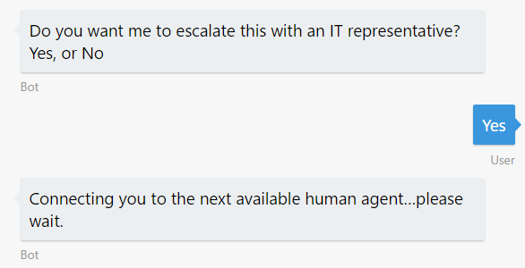

**演習 7: ヒューマン エージェントへの会話のハンドオフ**

ボットが持つ人工知能の能力がどんなに大きくても、まだ会話を人間にハンドオフしなければならない状況が発生することがあります。たとえば、質問に自動的に返信し、場所を問わずお客様に対応できる一方で、問題を人間にエスカレートできるボットを構築する必要があるでしょう。またボットがすべての状況に対応できない場合や、エッジケースが存在する場合、ボットは適切な権限を持つ人間にその対応を任せることができなければなりません。ボットはハンドオフが必要なタイミングを認識し、明確かつスムーズなハンドオフを実現する必要があります。この演習では、ボットを利用してユーザーと会話を開始し、コンテキストをヒューマン
エージェントにハンドオフする方法を学習します。

ボットのハンドオフ
パターンについては、[こちらの記事](https://docs.microsoft.com/en-us/bot-framework/bot-design-pattern-handoff-human)で詳しく説明します。

この
[C\#](https://github.com/GeekTrainer/help-desk-bot-lab/blob/develop/CSharp/exercise7-HandOffToHuman)
または
[Node.js](https://github.com/GeekTrainer/help-desk-bot-lab/blob/develop/Node/exercise7-HandOffToHuman)
のフォルダー内には、この演習のステップで作成するコードを含むソリューションが入っています。このソリューションは、演習を進めるにあたってさらにヒントが必要な場合に、ガイダンスとして使用できます。

ハンドオフ ロジックを実装できる複数の方法があることがわかります。このハンズオン
ラボでは、[こちらのサンプル](https://github.com/palindromed/Bot-HandOff)で実装されているアプローチと同様のアプローチを使用します。

この図は、この演習用のボットのコンポーネントを簡単に示しています。

**目標**

この演習を完了するためには、作成するボットが以下の操作を実行できなければなりません。

-   (演習 6 で)
    チケットの作成後にボットがフィードバックを要求したとき、ユーザーの感情が否定的であれば、ユーザーをヒューマン
    エージェントと話すためのキューに入れます。

-   ボットがテキスト「/agent
    login」を含むコマンドを受信した場合は、会話がヒューマン
    エージェントからのものであることを示すマークを付けます。この後に、このユーザーは次のことができます。

    -   「connect」と入力して、ヒューマン
        エージェントに接続します。この状態では、エージェントが入力するメッセージがすべてユーザーに転送されます。その逆も同じことが行われます。ボットは、"Message
        Forwarder" で変更されます。

    -   「help」と入力して、コマンド リストを取得します (オプション)。

    -   「resume」と入力して、ユーザーとの接続を切断し、ボットとの会話を再開します。

ボットとの対話のサンプルを次に示します。

| **エージェントのメッセージ**             | **ユーザーのメッセージ**                 |
|------------------------------------------|------------------------------------------|
| [./media/image4.png](./media/image4.png) | [./media/image5.png](./media/image5.png) |

**前提条件**

-   前の演習を完了していること、あるいは
    [C\#](https://github.com/GeekTrainer/help-desk-bot-lab/blob/develop/CSharp/exercise6-MoodDetection)
    または
    [Node.js](https://github.com/GeekTrainer/help-desk-bot-lab/blob/develop/Node/exercise6-MoodDetection)
    用の開始点を使用できることが必要です。

-   [LUIS ポータル](https://www.luis.ai/)のアカウント

-   [Azure](https://azureinfo.microsoft.com/us-freetrial.html?cr_cc=200744395&wt.mc_id=usdx_evan_events_reg_dev_0_iottour_0_0)
    サブスクリプション

**ハンドオフ メカニズムの実装**

このシナリオの実装は、このハンズオン
ラボで提供されている事前定義のアセットを使用すると簡単になります。

**Node.js** では、以下を実行できます。

1.  LUIS で、次の発話を含む **HandOffToHuman** インテントを追加します。

    -   *I want to talk to an IT representative*

    -   *Contact me to a human being*

2.  ハンズオン ラボの
    [assets](https://github.com/GeekTrainer/help-desk-bot-lab/blob/develop/assets)
    フォルダーから次のファイルをコピーします。

    -   [provider.js](https://github.com/GeekTrainer/help-desk-bot-lab/blob/develop/assets/exercise7-HandOffToHuman/provider.js):
        ヒューマン
        エージェントとの通信を待つユーザーを入れるキューを作成します。各会話には、次の
        3 つの状態があります:
        ConnectedToBot、WaitingForAgent、ConnectedToAgent。状態に応じて、(次のステップで構築する)
        ルーターがメッセージをどちらか一方の会話に転送します。このモジュールでは、外部ストレージでキューを存続させません。これは、会話のメタデータを格納する場所でもあります。

    -   [command.js](https://github.com/GeekTrainer/help-desk-bot-lab/blob/develop/assets/exercise7-HandOffToHuman/command.js):
        エージェントとボット間の特別な対話を処理し、会話や会話の再開を待つユーザーをピークします。このモジュールには、ヒューマン
        エージェントからのメッセージをインターセプトして、ユーザーとの接続や通信の再開を実行するオプションにメッセージをルーティングする[ミドルウェア](https://github.com/GeekTrainer/help-desk-bot-lab/blob/develop/assets/exercise7-HandOffToHuman/command.js#L9)があります。

3.  router.js
    ファイルを作成します。ルーターには、各メッセージがエージェントまたはユーザーのいずれに送信される必要があるかを把握する役割があります。ルーターによって公開される
    main 関数は、次のコードのようになります。

4.  const middleware = () =\> {

5.  return {

6.  botbuilder: (session, next) =\> {

7.  if (session.message.type === 'message') {

8.  if (isAgent(session)) {

9.  routeAgentMessage(session);

10. } else {

11. routeUserMessage(session, next);

12. }

13. } else {

14. next();

15. }

16. }

17. };

>   };

1.  ボットの app.js で、bot.use(...)
    を使用して各ミドルウェアをボットに接続します。

2.  const handOffRouter = new HandOffRouter(bot, (session) =\> {

3.  // agent identification goes here

4.  return session.conversationData.isAgent;

5.  });

6.  const handOffCommand = new HandOffCommand(handOffRouter);

7.  bot.use(handOffCommand.middleware());

>   bot.use(handOffRouter.middleware());

**C\#** では、以下を実行できます。

1.  ハンズオン ラボの assets フォルダーにある次のファイルを使用します。

    -   [AgentExtensions.cs](https://github.com/GeekTrainer/help-desk-bot-lab/blob/develop/assets/exercise7-HandOffToHuman/AgentExtensions.cs):
        通常ユーザーをエージェントに切り替え、エージェントを識別する、シンプルなロジックが含まれています。これを使用して、いずれは、会話、ユーザー、およびエージェントを管理する独自のロジックを実装できます。

    -   [Provider.cs](https://github.com/GeekTrainer/help-desk-bot-lab/blob/develop/assets/exercise7-HandOffToHuman/Provider.cs):
        ヒューマン
        エージェントとの通信を待つユーザーを入れるキューを作成します。このクラスでは、外部ストレージでキューを存続させません。これは、会話のメタデータを格納する場所でもあります。会話をデータ
        ストアに格納する場合は、カスタムの実装で Provider
        を更新するか、カスタムの実装を含む Provider を継承できます。

    -   [CommandScorable.cs](https://github.com/GeekTrainer/help-desk-bot-lab/blob/develop/assets/exercise7-HandOffToHuman/CommandScorable.cs):
        この Scorable はメッセージがエージェントからの場合にアクセスされ、agent
        help、connect、または resume
        メッセージを受信した場合に限り、その解決をトリガーします。ユーザーのメッセージがこれらのメッセージと一致しない場合、ユーザーのメッセージはこの
        Scorable で処理されません。

    -   [AgentLoginScorable.cs](https://github.com/GeekTrainer/help-desk-bot-lab/blob/develop/assets/exercise7-HandOffToHuman/AgentLoginScorable.cs):
        通常ユーザーとヒューマン エージェント間の切り替えを管理するクラスです。

2.  各メッセージがエージェントまたはユーザーのいずれに送信される必要があるかを把握する役割を持つ、RouterScorable.cs
    を作成します。PrepareAsync メソッドは、次のコードのようになります。

3.  protected override async Task\<ConversationReference\>
    PrepareAsync(IActivity activity, CancellationToken token)

4.  {

5.  var message = activity as Activity;

6.  if (message != null && !string.IsNullOrWhiteSpace(message.Text))

7.  {

8.  // determine if the message comes from an agent or user

9.  if (this.botData.IsAgent())

10. {

11. return this.PrepareRouteableAgentActivity(message.Conversation.Id);

12. }

13. else

14. {

15. return this.PrepareRouteableUserActivity(message.Conversation.Id);

16. }

17. }

18. return null;

>   }

1.  PrepareRouteableUserActivity は、会話の状態に応じてメッセージを送信する
    ConversationReference の正しいインスタンスを返す必要があります。

2.  protected ConversationReference PrepareRouteableUserActivity(string
    conversationId)

3.  {

4.  var conversation = this.provider.FindByConversationId(conversationId);

5.  if (conversation == null)

6.  {

7.  conversation = this.provider.CreateConversation(this.conversationReference);

8.  }

9.  switch (conversation.State)

10. {

11. case ConversationState.ConnectedToBot:

12. return null; // continue normal flow

13. case ConversationState.WaitingForAgent:

14. return conversation.User;

15. case ConversationState.ConnectedToAgent:

16. return conversation.Agent;

17. }

18. return null;

>   }

1.  必ず Global.asax の Application\_Start() メソッドに Scorable
    を登録してください。

**その他の課題**

自主的に学習を続ける場合は、次のタスクを利用できます。

-   Cosmos DB や SQL Server などの外部データ
    ストアに会話データを格納するカスタム プロバイダーを作成します。

-   AgentMenu
    ダイアログに、認証を追加します。ユーザーの認証プロセスを起動するには、[Sign-inCard](https://docs.botframework.com/en-us/node/builder/chat-reference/classes/_botbuilder_d_.signincard.html)
    を追加する必要があります。

-   [provider.js](https://github.com/GeekTrainer/help-desk-bot-lab/blob/develop/assets/exercise7-HandOffToHuman/provider.js#L13)
    または
    [Provider.cs](https://github.com/GeekTrainer/help-desk-bot-lab/blob/develop/assets/exercise7-HandOffToHuman/Provider.cs)
    を変更して、会話データが持続されるようにします。現状では、アクティブな会話はメモリ内に格納され、ボットの拡大/縮小は困難です。

-   ルーターに新しい状態を実装して、会話を監視できます。この場合、ユーザーとボットのメッセージはヒューマン
    エージェントに送信され監視されます。

-   ボットは、人間の応答を待機中、既定の応答を使用して、すべての受信ユーザー
    メッセージに自動的に対応します。"never mind" や "cancel"
    などの特定のメッセージをユーザーが送信した場合、ボットに "待機"
    状態から会話を削除させることができます。

-   ハンドオフの別の方法として、ヘルプ
    ダイアログに、会話を人間にハンドオフするボタンを追加します。

**参考資料**

-   [BUILD 2017](https://channel9.msdn.com/Events/Build/2017/P4075) のハンドオフ
    セッション

-   [ハンドオフ
    パターンの説明](https://docs.microsoft.com/en-us/bot-framework/bot-design-pattern-handoff-human)
