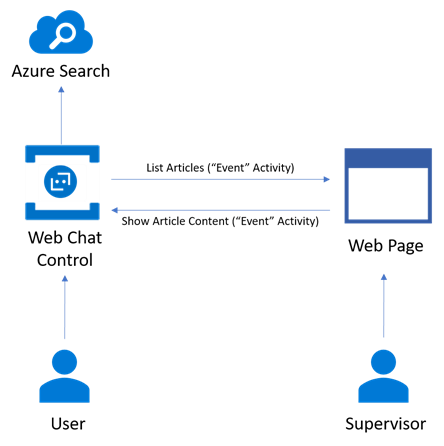
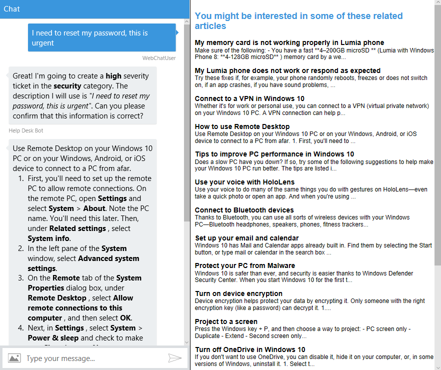

# 演習 8: バックチャネルを通したイベントの送受信

バックチャネル メカニズムを使用すると、ユーザーからは見えない情報をクライアント
アプリとボットがやり取りできます。たとえば、クライアントのタイム ゾーンの要求や
GPS の位置情報の読み取り、Web
ページでのユーザーの操作内容などがあります。ボットがユーザーをガイドして、Web
フォームの一部に自動的に記入することなどもできます。バックチャネルは、JavaScript
クライアント
アプリとボットの隔たりを埋める役割を果たします。このメカニズムは、Direct Line
API を使用して実装します。この API
を使用すると、クライアントとボットの間でアクティビティを送受信できます。

この演習では、アプリに Web ページを追加します。ボットと Web
ページはバックチャネル
メカニズムを使用して通信を行います。ボットはユーザーのチケットを Web
ページに送信し、Web
ページではそのチケットに関連するサポート技術情報の記事を表示します。目標は、人間のスーパーバイザー
エージェントが会話を監視し、Web
ページを使用してユーザーに役立つ記事があるかどうかを判断し、チケットの作成を回避できるようにすることです。ユーザーが記事を見つけたら、スーパーバイザー
エージェントはその記事をクリックし、ユーザーとボットの会話で表示します。

ボットのバックチャネル
パターンについては、[こちらの記事](https://docs.microsoft.com/en-us/bot-framework/nodejs/bot-builder-nodejs-backchannel)で詳しく説明します。

この
[C\#](./CSharp/exercise8-BackChannel)
または
[Node.js](./Node/exercise7-BackChannel)
のフォルダー内には、この演習のステップの完了結果として得られるコードを含むソリューションが入っています。このソリューションは、演習を進めるにあたってさらにヒントが必要な場合に、ガイダンスとして使用できます。

この図は、この演習のコンポーネントを簡単に示しています。

## 目標

この演習を完了するためには、ボットが以下の操作を実行し、Web
ページとやり取りできなければなりません。

-   ユーザーがチケットの詳細を入力すると、ボットが Azure Search
    で検索を実行し、返された記事をバックチャネルを通じて Web
    アプリに送信します。

-   スーパーバイザーが Web
    上で記事をクリックすると、ボットが記事のコンテンツを表示します。

ボットと Web アプリの対話のサンプルを次に示します。

## 前提条件

-   前の演習を完了していること、あるいは
    [C\#](./CSharp/exercise7-HandOffToHuman)
    または
    [Node.js](./Node/exercise7-HandOffToHuman)
    用の開始点を使用できることが必要です。

-   [LUIS ポータル](https://www.luis.ai/)のアカウント

-   [Azure](https://azureinfo.microsoft.com/us-freetrial.html?cr_cc=200744395&wt.mc_id=usdx_evan_events_reg_dev_0_iottour_0_0)
    サブスクリプション

## バックチャネル メカニズムの実装

### クライアント側のコード

-   ボット アプリに HTML
    ページを追加する必要があります。[assets](./assets)
    フォルダー内に用意されている[こちら](https://github.com/GeekTrainer/help-desk-bot-lab/blob/assets/exercise8-BackChannel/default.htm)を使用できます。

-   [Bot Framework ポータル](https://dev.botframework.com/)を使用して、ボットの
    Web チャット
    チャネルに新しいアプリを追加して、秘密鍵を取得します。次に、その秘密鍵を使用して、Web
    ページで [Direct
    Line](https://docs.botframework.com/en-us/restapi/directline3/) を開きます。

-   var botConnection = new BotChat.DirectLine({

-   secret: '{DIRECTLINE\_SECRET}'

>   });

-   Web ページに Web Chat
    コントロールを埋め込む必要があります。詳細については、[こちら](https://github.com/Microsoft/BotFramework-WebChat)を参照してください。

-   type="event" と name="searchResults" でアクティビティのボット アクティビティ
    リスナーを追加します。ボットがバックチャネルを通じて送信した検索結果を表示します。

-   botConnection.activity\$

-   .filter(function (activity) {

-   return activity.type === 'event' && activity.name === 'searchResults';

-   })

-   .subscribe(function (activity) {

-   // show the search results

>   });

-   エージェントがタイトルをクリックすると、バックチャネルを通じてアクティビティがポストされ、ボット
    イベントが呼び出されます。

-   botConnection

-   .postActivity({

-   type: 'event',

-   value: this.textContent.trim(),

-   from: { id: 'user' },

-   name: 'showDetailsOf'

>   });

> **注:** わかりやすくするため、ユーザーとの会話を含む Web Chat
コントロールと検索結果は同じページに表示します。ただし、この 2
つはそれぞれ別々に扱うことが理想的です。エージェントが監視と推奨記事の送信ができるように、スーパーバイザー
Web サイトには進行中の会話のリストを表示する必要があります。

### サーバー側のコード

-   ボットの SubmitTicket ダイアログを更新して、Azure Search
    でチケットの説明についての検索を実行し、ActivityTypes.Event
    型のメッセージを結果とともに送信します。

-   Node.js では bot.on() イベント リスナーを使用し、C\# では MessagesController
    の Post メソッドを使用して、Web ページから送信される ActivityTypes.Event
    型のメッセージをリッスンし、メッセージに応じて応答します。

-   bot.on(\`event\`, function (event) {

-   var msg = new builder.Message().address(event.address);

-   msg.data.textLocale = 'en-us';

-   if (event.name === 'showDetailsOf') {

-   // search for article and display it

-   }

>   });

>   public async Task\<HttpResponseMessage\> Post([FromBody]Activity activity)

>   {

>   if (activity.Type == ActivityTypes.Message)

>   {

>   await Conversation.SendAsync(activity, () =\> new RootDialog());

>   }

>   else if (activity.Type == ActivityTypes.Event)

>   {

>   // search for article and display it

>   }

>   ...

>   }

## 参考資料

-   [Microsoft Bot Framework WebChat
    コントロール](https://github.com/Microsoft/BotFramework-WebChat)

-   [Direct Line
    API](https://docs.botframework.com/en-us/restapi/directline3/#navtitle)

-   [BackChannel
    サンプル](https://github.com/Microsoft/BotFramework-WebChat/blob/master/samples/backchannel/index.html)

-   [Backchannel ボット](https://github.com/ryanvolum/backChannelBot)
